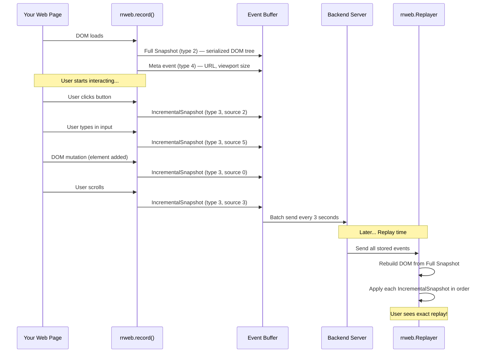
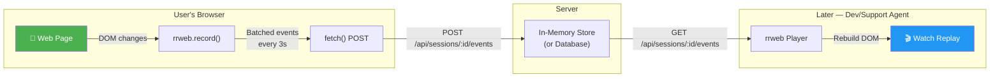
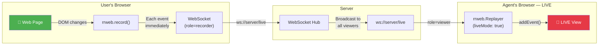
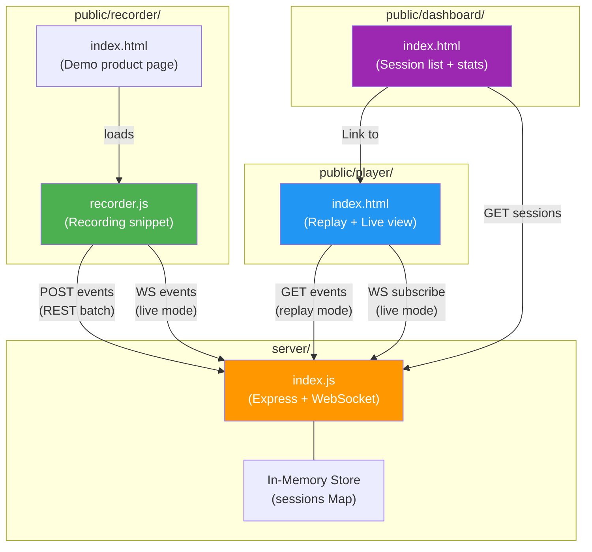
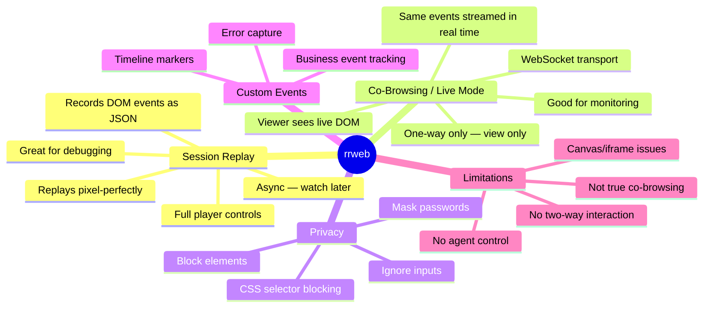

# rrweb Deep Dive — Session Replay & Co-Browsing Explained

This walkthrough explains **everything** about rrweb, how session replay and co-browsing work, and how your project implements both.

---

## 1. What is rrweb?

**rrweb** (record and replay the web) is an open-source JavaScript library that **records user sessions as structured data** (not video) and can **replay them pixel-perfectly** in the browser.

### How is it different from screen recording?

| Aspect | Screen Recording (Video) | rrweb (DOM Events) |
|--------|--------------------------|---------------------|
| **Format** | Video file (MP4, WebM) | JSON array of events |
| **Size** | 5–50 MB per minute | 50–200 KB per minute |
| **Interactivity** | Just a video — can only play/pause | Can inspect DOM, click elements, jump to events |
| **Privacy** | Records everything on screen | Can selectively mask passwords, block elements |
| **Performance** | High CPU/GPU overhead | Minimal — just observes DOM changes |
| **Integration** | Needs browser extension or native tool | Just a `<script>` tag — works in any browser |

---

## 2. How Does rrweb Work Internally?



### The Key Insight: Snapshots + Mutations

rrweb does **not** record the screen. Instead:

1. **Full Snapshot (Type 2)** — On page load, rrweb serializes the **entire DOM tree** into JSON. Think of this as a "keyframe" in video encoding. Every node gets a unique ID.

2. **Incremental Snapshots (Type 3)** — After that, rrweb uses `MutationObserver` to watch for ANY change to the DOM. Every attribute change, text change, node addition/removal is captured as a tiny event.

3. **Replay** — The replayer reconstructs the original DOM from the full snapshot, then applies each incremental change at the exact timestamp — recreating the exact user experience.

### Event Types in Your Project

| Type | Name | What It Captures |
|------|------|-----------------|
| 0 | `DomContentLoaded` | Page DOM is ready |
| 1 | `Load` | All resources loaded |
| 2 | `FullSnapshot` | Complete DOM serialization (the "keyframe") |
| 3 | `IncrementalSnapshot` | Any change — mutation, scroll, click, input, style |
| 4 | `Meta` | URL + viewport size |
| 5 | `Custom` | Your business events via `rrwebTrack()` |

### Incremental Snapshot Sources (Sub-types of Type 3)

| Source | Name | Example |
|--------|------|---------|
| 0 | Mutation | DOM element added/removed/changed |
| 1 | MouseMove | Cursor position |
| 2 | MouseInteraction | Click, double-click, focus, blur |
| 3 | Scroll | Page or element scrolled |
| 4 | ViewportResize | Browser window resized |
| 5 | Input | Form field value changed |
| 6 | TouchMove | Mobile touch events |
| 7 | MediaInteraction | Video/audio play/pause |
| 8 | StyleSheetRule | CSS rule changed via JS |

---

## 3. Session Replay — Explained

Session replay is about **recording now → watching later**. It's **asynchronous**.



### What makes it powerful for debugging:
- See **exactly** what the user saw before a bug
- Mouse cursor movements are replayed
- Form inputs are visible (except masked ones)
- You can scrub forward/backward like a video
- Custom events (like "checkout_started") appear as timeline markers

---

## 4. Co-Browsing / Live Mode — Explained

Co-browsing is about **watching in real-time**. It's **synchronous** — the agent sees what the user is doing RIGHT NOW.



### How Live Mode Differs from Session Replay

| Feature | Session Replay | Co-Browsing (Live Mode) |
|---------|---------------|------------------------|
| **When viewed** | After session ends | While session is active |
| **Transport** | HTTP REST (batched `POST`) | WebSocket (real-time stream) |
| **Latency** | Doesn't matter — it's historical | < 1 second, needs to be fast |
| **Replayer config** | Normal `rrwebPlayer` component | `new rrweb.Replayer({liveMode: true})` |
| **Event delivery** | All events loaded at once from API | Events arrive one-by-one via `addEvent()` |
| **Player controls** | Play/pause/scrub/speed up | No controls — just live feed |
| **Use case** | Bug investigation, UX analysis | Customer support, live assistance |

### The Critical Difference

> **Session Replay** = DVR (recorded TV — watch anytime, pause, rewind)  
> **Co-Browsing** = Live TV (you see what's happening right now)

---

## 5. Your Project Architecture

Your project implements **both** session replay AND co-browsing. Here's how all the pieces fit together:



---

## 6. Code Walkthrough — File by File

### 6.1 [recorder.js](file:///c:/Users/sthas/Personal/Projects/rrweb/public/recorder/recorder.js) — The Recording Engine

This is the heart of the system. It records everything the user does.

**Key Flow:**
1. **Sampling Gate** (lines 22–29): Decides whether to record this session based on `SAMPLE_RATE`. If `SAMPLE_RATE = 0.1`, only 10% of visitors get recorded. During development, it's set to `1.0` (record everyone).

2. **Load rrweb from CDN** (lines 33–36): Dynamically injects the rrweb library from jsDelivr CDN.

3. **Session Creation** (lines 46–61): Calls `POST /api/sessions` to get a unique session ID, stored in `sessionStorage` so it persists within the tab.

4. **Recording** (lines 117–155): This is where `rrweb.record()` is called with configuration:
   ```js
   rrweb.record({
     emit(event) { ... },      // Called on EVERY DOM event
     maskInputOptions: { password: true, tel: true },
     sampling: { mousemove: 50, scroll: 150 },
     checkoutEveryNms: 30000,   // New full snapshot every 30s
   });
   ```

5. **Two Transport Modes:**
   - **REST mode** (`USE_WEBSOCKET = false`): Events buffer up, flushed every 3 seconds via `fetch POST`
   - **WebSocket mode** (`USE_WEBSOCKET = true`): Each event sent immediately via WebSocket for live co-browsing

6. **Error capture** (lines 190–202): JS errors and unhandled promise rejections are captured as custom events and trigger an immediate flush.

---

### 6.2 [index.js](file:///c:/Users/sthas/Personal/Projects/rrweb/server/index.js) — The Server

Express server with two responsibilities:

**REST API (lines 50–109):**
| Endpoint | Purpose |
|----------|---------|
| `POST /api/sessions` | Create session, return UUID |
| `POST /api/sessions/:id/events` | Store batched events |
| `GET /api/sessions` | List all sessions (for dashboard) |
| `GET /api/sessions/:id/events` | Fetch events for replay |
| `DELETE /api/sessions/:id` | Delete a session |

**WebSocket Server (lines 111–167):**
- Path: `ws://localhost:3000/live?session=<id>&role=<viewer|recorder>`
- **Viewer role**: Added to a "room" for that session. Gets a `catchup` message with all existing events, then receives new events as they arrive.
- **Recorder role**: Sends events which get stored AND broadcast to all viewers.
- This is the backbone of co-browsing.

**Key data structure:**
```js
// sessions Map — each entry looks like:
{
  id: "uuid",
  url: "http://...",
  userAgent: "Mozilla/5.0...",
  startedAt: 1713277965000,
  lastEventAt: 1713278000000,
  eventCount: 347,
  events: [ {...}, {...}, ... ]  // array of rrweb event objects
}
```

---

### 6.3 [player/index.html](file:///c:/Users/sthas/Personal/Projects/rrweb/public/player/index.html) — The Replay + Live View

This page handles BOTH modes based on URL parameters:
- `?session=<id>` → **Replay mode** (loads events from REST API, builds player)
- `?session=<id>&live=true` → **Live mode** (connects via WebSocket, uses `liveMode: true`)

**Replay Mode (lines 272–284):**
```js
// Fetches all events → builds player with controls
const { events } = await fetch(`/api/sessions/${sessionId}/events`).then(r => r.json());
new rrwebPlayer({ target: container, props: { events, autoPlay: true } });
```

**Live Mode (lines 287–367):**
```js
// Connects via WebSocket → receives events in real-time
const ws = new WebSocket(`ws://.../live?session=${sessionId}&role=viewer`);
ws.onmessage = (msg) => {
  if (type === 'catchup') buildLiveReplayer(events);  // Initial state
  if (type === 'events') replayer.addEvent(event);     // Ongoing updates
};

// Uses raw Replayer with liveMode
new rrweb.Replayer(events, { liveMode: true });
replayer.startLive(timestamp);
```

**Features:**
- Speed controls (0.5x, 1x, 2x, 4x)
- Custom events sidebar with jump-to-time
- Fallback polling if WebSocket fails

---

### 6.4 [dashboard/index.html](file:///c:/Users/sthas/Personal/Projects/rrweb/public/dashboard/index.html) — Session Management

Lists all recorded sessions with:
- Total sessions, events count, average duration stats
- Search/filter functionality
- Replay and Live View buttons for each session
- Auto-refreshes every 5 seconds

---

## 7. Can This Project Do Co-Browsing? Honestly?

### ✅ What it CAN do (and does well):

| Capability | Status | How |
|-----------|--------|-----|
| Session recording | ✅ Works | `rrweb.record()` → REST batch → server storage |
| Session replay | ✅ Works | `rrwebPlayer` with full controls |
| Live monitoring (one-way) | ✅ Works | WebSocket + `Replayer({liveMode: true})` |
| Privacy/masking | ✅ Works | `maskInputOptions`, `.rr-block`, `.rr-mask` CSS classes |
| Custom event tracking | ✅ Works | `rrwebTrack()` → timeline markers |
| Error capture | ✅ Works | `window.onerror` → immediate flush |

### ⚠️ What it CANNOT do (limitations of rrweb for co-browsing):

| Limitation | Explanation |
|-----------|-------------|
| **One-way only** | Agent can WATCH the user but **cannot interact** — can't click, scroll, or type on behalf of the user |
| **No cursor sharing** | Agent's cursor isn't visible to the user |
| **No highlighting** | Agent can't highlight elements to guide the user |
| **No form co-editing** | Agent can't fill in forms for the user |
| **No two-way communication** | No built-in chat, voice, or annotation |
| **~1 second delay** | WebSocket adds slight latency — not truly "real-time" |
| **Cross-origin limitations** | iframes from different origins won't be captured |
| **Canvas elements** | Canvas content (charts, games) may not replay correctly |
| **Shadow DOM** | Web components with Shadow DOM may not be fully captured |

### 🎯 Verdict

> **This project is a GREAT session replay tool and a DECENT live monitoring tool, but it is NOT true co-browsing.**

True co-browsing (like Cobrowse.io, LiveAgent, etc.) allows the agent to **take control** and **interact with the user's page**. rrweb is fundamentally **read-only** on the viewer side.

**Think of it this way:**

| Tool | Analogy |
|------|---------|
| rrweb Session Replay | 📼 Watching a recorded security camera |
| rrweb Live Mode | 📺 Watching a live security camera feed |
| True Co-Browsing | 🎮 Remote desktop — you can take control |

---

## 8. How to Test Both Features

### Test Session Replay:
1. Start the server: `npm start`
2. Open `http://localhost:3000/recorder/` — interact with the page
3. Open `http://localhost:3000/dashboard/` — see your session listed
4. Click **▶ Replay** — watch your exact session play back

### Test Live Mode (Co-Browsing):
1. In [recorder.js](file:///c:/Users/sthas/Personal/Projects/rrweb/public/recorder/recorder.js), change `USE_WEBSOCKET = false` to `USE_WEBSOCKET = true`
2. Restart the server
3. Open `http://localhost:3000/recorder/` in Browser Tab 1
4. Copy the Session ID from the bottom of the page
5. Open `http://localhost:3000/player/?session=<SESSION_ID>&live=true` in Browser Tab 2
6. Go back to Tab 1 and interact — Tab 2 updates in real-time!

---

## 9. Summary



> [!TIP]
> **For learning purposes**, this project is excellent. It demonstrates both session replay and live monitoring patterns clearly. If you need true bi-directional co-browsing in the future, you'd need to add a reverse communication channel (WebRTC + DOM manipulation proxy), which is what commercial co-browsing tools build on top of similar concepts.
